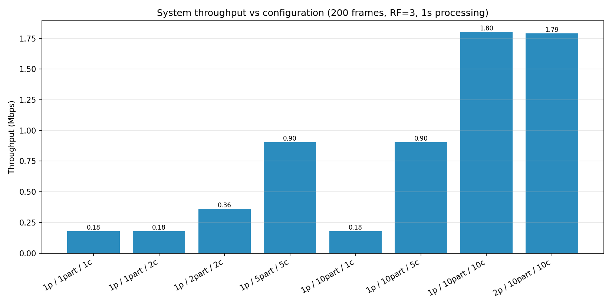
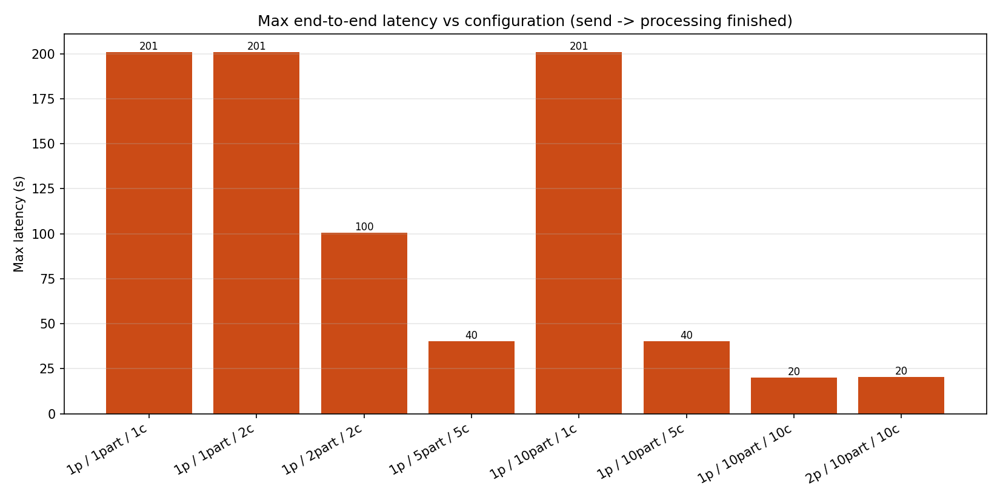

# HW2 - Kafka/Redpanda Throughput Investigation (video frames)

A dummy distributed application where microservices communicate through Kafka
(Redpanda), used to measure how **throughput** and **latency** scale with the number
of **producers, consumers, and partitions**.


## Requirements

- Docker + Docker Compose
- ffmpeg
- Python 3.11+ with uv

## How to run

```bash
# 1. Python env
uv venv .venv
uv pip install --python .venv -r requirements.txt

# 2. Start the 3-broker Redpanda cluster
docker compose up -d
docker exec hw2-redpanda-0 rpk cluster health

# 3. Prepare the dataset
.venv/bin/python -m src.prepare_video --frames 200 --minutes 30

# 4. Run all experiments
.venv/bin/python -m src.run_all --frames 200 --sleep 1.0

# 5. Plot
.venv/bin/python plot_results.py

```

## Experiments

| # | Producers | Partitions | Consumers | Efective parallelism |
|---|-----------|------------|-----------|-----------------------------------|
| exp1 | 1 | 1  | 1  | 1 |
| exp2 | 1 | 1  | 2  | 1 (extra consumer idle - only 1 partition) |
| exp3 | 1 | 2  | 2  | 2 |
| exp4 | 1 | 5  | 5  | 5 |
| exp5 | 1 | 10 | 1  | 1 (one consumer drains all 10 partitions) |
| exp6 | 1 | 10 | 5  | 5 |
| exp7 | 1 | 10 | 10 | 10 |
| exp8 | 2 | 10 | 10 | 10 (input split across 2 producers) |

## Results

200 frames (4.55 MB total), RF=3

| # | Config | Throughput (Mbps) | Max latency (s) | Makespan (s) | Active consumers |
|---|--------|------------------:|----------------:|-------------:|-----------------:|
| exp1 | 1p / 1part / 1c   | 0.18 | 201 | 200.9 | 1 |
| exp2 | 1p / 1part / 2c   | 0.18 | 201 | 200.9 | 1 |
| exp3 | 1p / 2part / 2c   | 0.36 | 100 | 100.6 | 2 |
| exp4 | 1p / 5part / 5c   | 0.90 |  40 |  40.2 | 5 |
| exp5 | 1p / 10part / 1c  | 0.18 | 201 | 200.8 | 1 |
| exp6 | 1p / 10part / 5c  | 0.90 |  40 |  40.2 | 5 |
| exp7 | 1p / 10part / 10c | 1.80 |  20 |  20.2 | 10 |
| exp8 | 2p / 10part / 10c | 1.79 |  20 |  20.3 | 10 |



